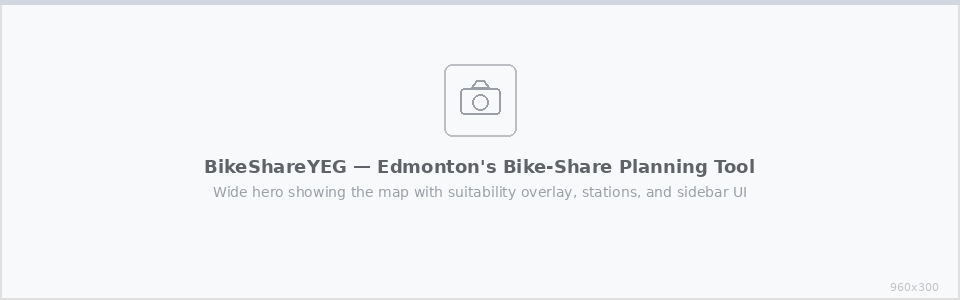
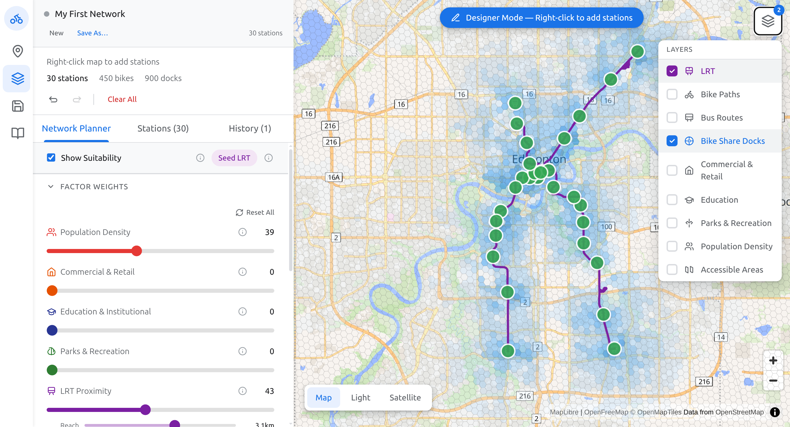
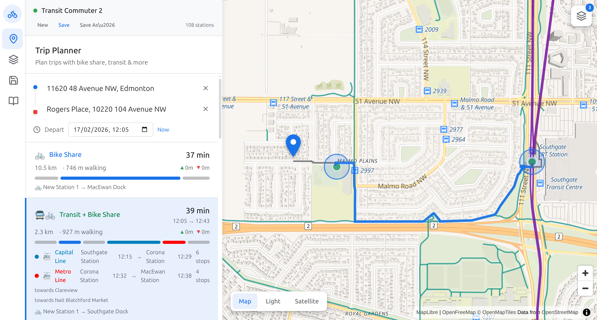

<p align="center">
  
</p>

<h1 align="center">BikeShareYEG</h1>

<p align="center">
  <strong>An open-source civic tool for designing bike-share networks in Edmonton, Alberta.</strong>
</p>

<p align="center">
  <a href="#features">Features</a> &middot;
  <a href="#getting-started">Getting Started</a> &middot;
  <a href="#how-it-works">How It Works</a> &middot;
  <a href="#contributing">Contributing</a> &middot;
  <a href="#license">License</a>
</p>

---

## Why BikeShareYEG?

Edmonton is investing heavily in LRT expansion, but the "last mile" problem remains: thousands of Edmontonians live *just* too far from a transit stop to walk comfortably. A well-designed bike-share network could bridge that gap, dramatically increasing the reach and effectiveness of public transit.

**BikeShareYEG gives planners and citizens a shared space to explore that idea.** Design a bike-share network according to your values, adjust the tradeoffs, and then actually *see* what it would be like to live in an Edmonton with bike-share — through a Google Maps-style route finder that routes you through your proposed network.

It's an exercise in imagination, backed by real data.

## Features

### Route Planner
Plan multimodal trips across Edmonton combining walking, cycling, transit, and your bike-share network. See turn-by-turn directions, elevation profiles, and travel time comparisons — all powered by OpenTripPlanner.

### Network Designer
Click to place and drag stations on the map. Adjust dock counts, view station metadata, and build your ideal network interactively with full undo/redo support.

### Optimization Engine
Let algorithms do the heavy lifting. Choose between:

- **Iterative MCLP** — OR-Tools CP-SAT solver maximises demand coverage subject to spacing constraints, solved in configurable batches
- **Greedy** — fast, interpretable placement that recalculates the suitability surface after each station
- **Step Mode** — place one optimal station at a time and watch the suitability heatmap respond in real time

### Suitability Overlay
A live H3 hex-grid heatmap blending population density, LRT proximity, bike infrastructure, and transit access. Adjust factor weights and decay radii with sliders and see the map update instantly.

### Saved Networks
Save and load network drafts to localStorage. Compare different designs, iterate on ideas, and (eventually) share them with others.

### Documentation
Built-in docs at `/docs` covering project goals, getting started guides, algorithm deep-dives, data source details, and technical architecture.

## Screenshots

> The `frontend/public/docs/` directory contains placeholder images. Replace them with actual screenshots for the best presentation.

| Suitability Overlay | Network Designer | Route Planner |
|:---:|:---:|:---:|
|  |  |  |

## Getting Started

### Prerequisites

- **Python** &ge; 3.11
- **Node.js** &ge; 20
- **Docker** (optional, for OpenTripPlanner routing)
- [uv](https://docs.astral.sh/uv/) recommended for Python dependency management

### 1. Clone the repo

```bash
git clone git@github.com:grworg/bikeshareyeg.git
cd bikeshareyeg
```

### 2. Backend

```bash
cd backend

# Using uv (recommended)
uv venv && source .venv/bin/activate
uv pip install -e .

# Or using pip
python -m venv .venv && source .venv/bin/activate
pip install -e .
```

Copy the environment file and (optionally) add your Edmonton Open Data token for higher API rate limits:

```bash
cp .env.example .env
```

Start the API server:

```bash
uvicorn src.api.main:app --reload --port 8000
```

### 3. Frontend

```bash
cd frontend
npm install
npm run dev
```

Open [http://localhost:3000](http://localhost:3000). The frontend proxies `/api/*` to the backend on port 8000.

### 4. OpenTripPlanner (optional)

For multimodal routing, set up OTP with Edmonton transit data:

```bash
./scripts/setup-otp.sh      # downloads GTFS + OSM data
docker compose up -d         # starts OTP on port 8080
```

OTP takes a minute or two to build its graph on first start. Check health with:

```bash
docker compose logs -f otp
```

## Architecture

```
bikeshareyeg/
├── backend/                 # Python — FastAPI, optimization, data processing
│   └── src/
│       ├── api/             # REST endpoints (routes, stations, planner, overlays)
│       ├── data/            # Edmonton data fetching (Overpass, Open Data, GTFS, OTP)
│       └── optimization/    # MCLP solver, greedy algorithm, suitability engine
├── frontend/                # TypeScript — Next.js, Deck.gl, MapLibre
│   └── src/
│       ├── app/             # Pages (main app, /docs)
│       ├── components/      # Map, sidebar panels, controls
│       └── lib/             # API client, types, state utilities
├── data/                    # Runtime data (gitignored caches, OTP config)
├── scripts/                 # Setup and data processing scripts
└── notebooks/               # Jupyter exploration notebooks
```

## Tech Stack

### Backend

| Library | Purpose |
|---------|---------|
| [FastAPI](https://fastapi.tiangolo.com/) | REST API server |
| [OR-Tools](https://developers.google.com/optimization) | MCLP station placement (CP-SAT solver) |
| [H3](https://h3geo.org/) | Hexagonal spatial indexing |
| [NumPy](https://numpy.org/) | Vectorised suitability calculations |
| [OpenTripPlanner](https://www.opentripplanner.org/) | Multimodal transit routing |
| [httpx](https://www.python-httpx.org/) | Async HTTP (Overpass API, OTP) |

### Frontend

| Library | Purpose |
|---------|---------|
| [Next.js 15](https://nextjs.org/) | React framework |
| [Deck.gl 9](https://deck.gl/) | GPU-accelerated map layers |
| [MapLibre GL JS](https://maplibre.org/) | Open-source base map (no API key needed) |
| [Tailwind CSS 4](https://tailwindcss.com/) | Utility-first styling |

### Data Sources

| Source | Data | Link |
|--------|------|------|
| OpenStreetMap | LRT stations, bike lanes, bus stops, street network | [overpass-api.de](https://overpass-api.de/) |
| Statistics Canada | Census population by dissemination area | [statcan.gc.ca](https://www.statcan.gc.ca) |
| City of Edmonton | GTFS transit schedules, open data | [data.edmonton.ca](https://data.edmonton.ca) |

## How It Works

### Suitability Surface

Each H3 hex cell receives a 0–1 score per factor (population density, LRT proximity, bike infrastructure, transit access). Users set weights and decay radii; the frontend blends scores in real time. The backend pre-computes raw distances so custom decay curves don't require a server round-trip.

### Station Placement

The **Iterative MCLP** solver formulates a binary integer program: maximise suitability-weighted demand coverage subject to a station budget and minimum-spacing constraints. It solves in batches, recalculating the suitability surface between rounds to account for proximity discounts and network connectivity.

The **Greedy** algorithm places one station at a time at the highest-scoring hex, recomputing the full suitability surface (with proximity/connectivity modifiers) after each placement. Faster and more interpretable, but without the global optimality guarantees of MCLP.

### Routing

Multimodal routing is handled by OpenTripPlanner with Edmonton's GTFS data. The frontend sends origin/destination pairs and receives walk + bike + transit itineraries. A GTFS-based fallback provides LRT-only routing when OTP is unavailable.

## Contributing

Contributions are welcome! Please read [CONTRIBUTING.md](CONTRIBUTING.md) for guidelines on how to get involved.

This project follows the [Contributor Covenant Code of Conduct](CODE_OF_CONDUCT.md).

## Self-Hosting (Production)

BikeShareYEG ships with everything needed to self-host on a single VM (tested on Hetzner CX22/CX32 running Ubuntu 24.04).

```bash
# 1. Clone and run the setup script
git clone https://github.com/grworg/bikeshareyeg.git /opt/bikeshareyeg
bash /opt/bikeshareyeg/deploy/setup.sh your-domain.com

# 2. Review the generated .env
nano /opt/bikeshareyeg/.env

# 3. Start services
cd /opt/bikeshareyeg && docker compose up -d          # OTP
systemctl start bikeshareyeg-api bikeshareyeg-web caddy
```

The setup script installs all dependencies, builds the frontend, configures Caddy (auto-HTTPS), sets up systemd services with resource limits, and enables UFW. See [`deploy/`](deploy/) for individual config files.

**What's included out of the box:**
- Per-session station state (visitors don't interfere with each other)
- Rate limiting on expensive endpoints (MCLP, routing)
- Input validation with sensible caps
- Upstream API response caching
- Caddy reverse proxy with automatic HTTPS
- systemd service units with memory/CPU limits
- UFW firewall (SSH + HTTP/S only)

## Roadmap

- [ ] Simulation engine (SimPy discrete-event modelling of trips, rebalancing)
- [ ] Network sharing via URL / export
- [ ] Real screenshots replacing placeholder images in docs
- [ ] Cost estimation model
- [ ] Accessibility and equity analysis layers
- [ ] Mobile-responsive UI improvements

## License

[MIT](LICENSE) — use it, fork it, build on it.

---

<p align="center">
  Built with data from the City of Edmonton, Statistics Canada, and OpenStreetMap.<br/>
  Made in Edmonton, for Edmonton.
</p>
